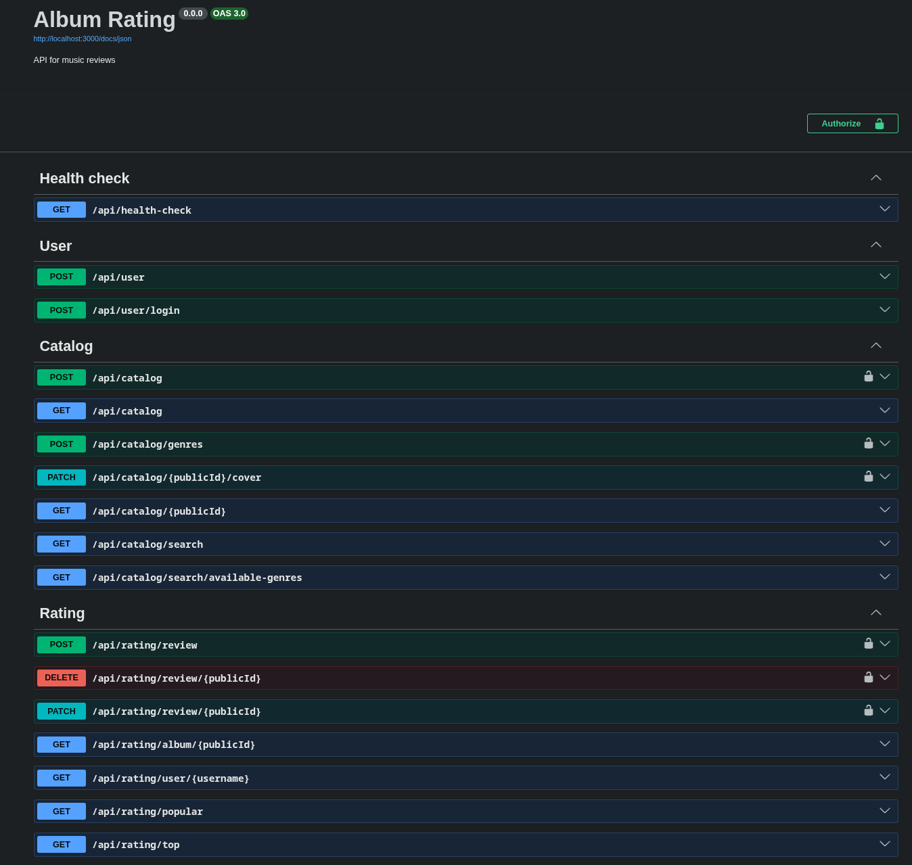
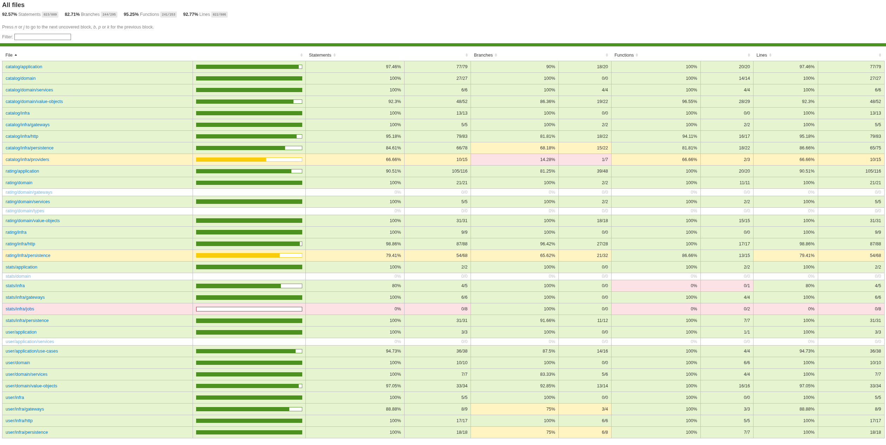
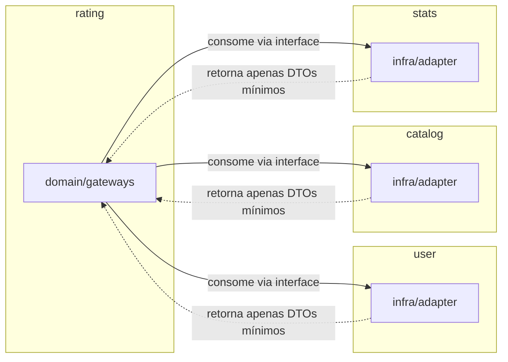

# Albums Rating

[](https://github.com/AbnerCerqueira/albums-rating/actions)
[](#cobertura-de-testes)
[](#licença)
[](https://nodejs.org)

API REST para catálogo de álbuns musicais e avaliação de usuários, construída com **TypeScript, Node.js e Fastify**, se inspirando em **Domain-Driven Design** para encapsulamento de regras de negócio e desacoplamento entre domínio e infraestrutura em contextos delimitados.

> Além de funcionar de ponta a ponta, foi desenhado para demonstrar arquitetura limpa, testes de comportamento, CI automatizada e decisões técnicas que resolvem problemas reais (leia a seção [O que este projeto resolve](#o-que-este-projeto-resolve-no-dia-a-dia)).

---

## Sumário

- [Screenshots](#screenshots)
- [O que a API faz](#o-que-a-api-faz)
- [Tecnologias](#tecnologias)
- [Arquitetura](#arquitetura)
- [O que este projeto resolve no dia a dia](#o-que-este-projeto-resolve-no-dia-a-dia)
- [Limitações e próximos passos](#limitações-e-próximos-passos)
- [Como rodar](#como-rodar)
- [Licença](#licença)

---

## Screenshots

### Documentação da API

<p align="center">
  
</p>

> Swagger UI gerada automaticamente a partir dos schemas Zod, request, response e documentação nunca ficam dessincronizados.

### Exemplo de resposta: Rankings

```jsonc
// GET /api/rating/top?page=1&size=2
{
  "albums": [
    {
      "artist": "Björk",
      "averageRating": 4.12,
      "coverUrl": "http://localhost:3000/covers/default-cover.png",
      "format": "LP",
      "genres": [
        "Art Pop",
        "Electronic",
        "Folktronica",
        "Ambient Pop",
        "Glitch Pop"
      ],
      "publicId": "bjork-vespertine",
      "releaseDate": "2001-08-18",
      "reviewCount": 33,
      "title": "Vespertine"
    },
    {
      "artist": "Thou",
      "averageRating": 3.88,
      "coverUrl": "http://localhost:3000/covers/default-cover.png",
      "format": "LP",
      "genres": [
        "Sludge Metal",
        "Atmospheric Sludge Metal",
        "Doom Metal",
        "Drone Metal"
      ],
      "publicId": "thou-tyrant",
      "releaseDate": "2007-09-21",
      "reviewCount": 20,
      "title": "Tyrant"
    }
  ],
  "currentPage": 1,
  "size": 2,
  "total": 114,
  "totalPages": 57
}
```

> Foi utilizado média bayesiana para rankeamento

### Exemplo de resposta: Álbuns populares por período

```jsonc
// GET /api/rating/popular?from=2020&to=2026&page=1&size=10
{
  "albums": [
    {
      "artist": "ARTMS",
      "averageRating": 3.64,
      "coverUrl": "http://localhost:3000/covers/default-cover.png",
      "format": "LP",
      "genres": [
        "K-Pop",
        "Alt-Pop",
        "Contemporary R&B",
        "Dance-Pop",
        "Synthpop",
        "Future Bass",
        "UK Garage"
      ],
      "publicId": "artms-dall",
      "releaseDate": "2024-05-31",
      "reviewCount": 46,
      "title": "Dall"
    },
    {
      "artist": "Fear Before The March Of Flames",
      "averageRating": 3.67,
      "coverUrl": "http://localhost:3000/covers/default-cover.png",
      "format": "LP",
      "genres": [
        "Post-Hardcore",
        "Metalcore",
        "Mathcore",
        "Screamo",
        "Sasscore"
      ],
      "publicId": "fear-before-the-march-of-flames-art-damage",
      "releaseDate": "2004-09-07",
      "reviewCount": 44,
      "title": "Art Damage"
    },
    {
      "artist": "Killing Me Softly",
      "averageRating": 3.45,
      "coverUrl": "http://localhost:3000/covers/default-cover.png",
      "format": "LP",
      "genres": [
        "Post-Hardcore",
        "Metalcore",
        "Mathcore",
        "Screamo",
        "Melodic Metalcore"
      ],
      "publicId": "killing-me-softly-autumn-lost-in-silence",
      "releaseDate": "2023-12-01",
      "reviewCount": 40,
      "title": "Autumn Lost in Silence"
    }
  ],
  "currentPage": 1,
  "size": 3,
  "total": 45,
  "totalPages": 15
}

```

### Cobertura de testes

<p align="center">
  
</p>

> 93%+ de statements cobertos com Vitest, entre testes unitários (regras de domínio) e e2e (fluxos HTTP sobre MongoDB em memória).

---

## O que a API faz

| Funcionalidade | Detalhe |
|---|---|
| Cadastro e autenticação | JWT com expiração, senha com hash bcrypt, validação forte de email/username/senha |
| Catálogo de álbuns e gêneros | Álbum com capa, formato (LP/EP/Single/...), data de lançamento e gêneros |
| Busca | Por título, artista e gênero, com paginação em todas as listagens |
| Upload de capa | JPEG/PNG/WebP até 5MB, com substituição e remoção do arquivo antigo |
| Reviews | Nota de 0 a 5 (passos de 0.5), texto opcional, favorito, edição e exclusão |
| Rankings | Álbuns **populares** e **mais bem avaliados** com score bayesiano |
| Documentação | Swagger UI gerada automaticamente em `/docs` |

### Endpoints

**Públicos**

| Método | Rota | Descrição |
|---|---|---|
| `GET` | `/docs` | Documentação interativa (Swagger UI) |
| `GET` | `/api/health-check` | Health check |
| `POST` | `/api/user` | Criar usuário |
| `POST` | `/api/user/login` | Autenticar e obter token JWT |
| `GET` | `/api/catalog` | Listar álbuns (paginado) |
| `GET` | `/api/catalog/search` | Buscar álbuns por título/artista |
| `GET` | `/api/catalog/search/available-genres` | Buscar gêneros |
| `GET` | `/api/catalog/:publicId` | Consultar álbum |
| `GET` | `/api/rating/album/:publicId` | Reviews de um álbum |
| `GET` | `/api/rating/user/:username` | Reviews de um usuário |
| `GET` | `/api/rating/popular` | Álbuns mais avaliados |
| `GET` | `/api/rating/top` | Álbuns com melhor média |

**Autenticados (Bearer token)**

| Método | Rota | Descrição |
|---|---|---|
| `POST` | `/api/catalog` | Criar álbum |
| `POST` | `/api/catalog/genres` | Criar gênero |
| `PATCH` | `/api/catalog/:publicId/cover` | Upload de capa |
| `POST` | `/api/rating/review` | Criar review (uma por usuário + álbum) |
| `PATCH` | `/api/rating/review/:publicId` | Editar review (somente o dono) |
| `DELETE` | `/api/rating/review/:publicId` | Deletar review (somente o dono) |

---

## Tecnologias

| Camada | Tecnologia |
|---|---|
| Linguagem | TypeScript (strict, NodeNext) |
| Runtime | Node.js |
| HTTP | Fastify 5 + `fastify-type-provider-zod` |
| Persistência | MongoDB + Mongoose |
| Validação | Zod (schemas únicos que validam request, response e geram Swagger) |
| Autenticação | JWT + bcryptjs |
| Uploads | `@fastify/multipart` + `@fastify/static` |
| Logging | Pino com múltiplos transports (console + arquivo) |
| Jobs agendados | node-cron (refresh semanal dos rankings) |
| Testes | Vitest + `mongodb-memory-server` (unit e e2e) |
| Lint/Format | Biome + Ultracite |
| Infra | Docker multi-stage, docker compose com healthchecks |
| CI | GitHub Actions (6 jobs em paralelo) |

---

## Arquitetura

Organizada em **contextos de negócio**, cada um com as camadas `domain` → `application` → `infra`, onde a dependência sempre aponta para dentro:

```text
src/
├── contexts/
│   ├── !common/            # apenas utilitários: Result, erros, paginação, event bus, slugify
│   ├── shared/             # conceitos de domínio compartilhados: PublicId, projeções de chart, contadores de review
│   ├── user/               # usuários e autenticação
│   ├── catalog/            # álbuns, gêneros e capas
│   ├── rating/             # reviews
│   └── stats/              # rankings (cache materializado + job)
├── infra/
│   ├── config/             # validação de env com Zod
│   ├── http/               # plugins Fastify, middleware de auth, schemas
│   └── lib/                # logging, hash
├── app.ts                  # instância Fastify
├── main.ts                 # bootstrap
└── server.ts               # conexão MongoDB + scheduler
```

Principais decisões de design:

- **Ports & adapters entre contextos**: o contexto `rating` consome `user`, `catalog` e `stats` somente através de *gateways*: interfaces definidas no domain do consumidor, implementadas no infra do provedor, retornando apenas DTOs mínimos (IDs). Nenhum contexto importa repositório ou entidade de outro.
- **Conceitos de domínio compartilhados em `shared`**: projeções de ranking (`ChartAlbumProjection`) e contadores de reviews (`AlbumReviewCounts`) não são duplicados entre `stats` e `rating`/`catalog`; vivem num único lugar consumível por todos os contextos, enquanto `!common` guarda apenas utilitários (Result, erros, paginação).
- **Entidades imutáveis**: métodos como `Review.edit()` retornam uma nova instância em vez de mutar o estado, tornando o comportamento previsível e testável.
- **Value objects com regras próprias**: `Rating` só aceita 0 a 5 em passos de 0.5; IDs compostos (`UserId` = email + username, `AlbumId` = artista + título) eliminam consultas de verificação duplicadas.
- **Erros previsíveis retornam `Result`**: validação, 404, 409, 403 nunca lançam exceção. Além de deixar o fluxo de erro explícito e tipado, essa escolha tem um ganho direto de performance: exceções no Node.js quebram as otimizações da V8, então o `Result` evita o custo de lançar exceções em fluxos que são esperados e frequentes. Erros imprevisíveis passam por error handler global com log estruturado.
- **Injeção de dependência manual**: um `compose.ts` por contexto, sem framework de DI.



---

## Por que monólito modular, e não microsserviços?
Os contextos (`user`, `catalog`, `rating`, `stats`) já são desacoplados por gateways e DTOs mínimos — a mesma disciplina de fronteira que microsserviços impõem. A diferença é que aqui isso não custa rede, deploy distribuído, consistência eventual ou orquestração: tudo roda num único processo, com transações e testes simples. Se um contexto crescer a ponto de justificar isolamento (ex: `stats` com carga própria), a extração é uma mudança de infra, não uma reescrita de domínio — o gateway já define exatamente essa fronteira.

---

## O que este projeto resolve no dia a dia

Cada problema é implementado como uma mudança localizada, sem efeito colateral em regras de negócio já testadas:

| # | Problema | Solução | Contexto |
|---|---------|---------|----------|
| 1 | **Rankings que não escalam** | Cache materializado via `$out` + job semanal + refresh sob demanda por evento `CHART_CACHE_MISSED` | `stats` |
| 2 | **Ranking injusto** | Score bayesiano: média ponderada com prior de 5 reviews para evitar que poucos votos distorçam o topo | `get-top-albums` |
| 3 | **Complexidade prematura de microsserviços** | Monólito modular: contextos desacoplados por gateways simulam fronteiras de serviço, mas sem custo de rede, deploy distribuído ou consistência eventual, caso seja necessário a extração para serviço próprio é possível sem reescrever regras de negócio | arquitetura geral |
| 4 | **Erros como dado, não exceção** | `Result` tipado para erros esperados (404, 409, 403); exceção reservada para falhas inesperadas, evita custo de throw na V8 | `!common/result.ts` |
| 5 | **Validação ≠ documentação** | Um schema Zod por rota valida request/response **e** gera Swagger, nunca dessincroniza | schemas |
| 6 | **Unicidade concorrente** | "Uma review por usuário + álbum" garantida em duas camadas: domínio + índice único MongoDB | `review` |
| 7 | **Upload seguro e portável** | Tipos, tamanho e nome controlados; `ImageProvider` permite trocar disco por S3 sem tocar use-cases | `catalog` |
| 8 | **Paginação consistente** | Value object `Pagination` + helpers `paginateFind`/`paginateAggregate` usados em todas as listagens e rankings | `!common/pagination.ts` |
| 9 | **Confiança de entrega** | 288 testes (unit + e2e), ~93% coverage, CI com 6 jobs paralelos | testes + CI |

---

## Limitações e próximos passos

O projeto cobre um fluxo completo de ponta a ponta, mas não é uma plataforma pronta para produção. A separação em contextos com camadas `domain`/`application`/`infra` permite que cada evolução seja uma mudança localizada:

| Item | Status atual | Evolução natural |
|------|-------------|------------------|
| **Uploads** | Disco local (não sobrevive a múltiplas instâncias) | S3/Cloudinary via `ImageProvider`, adapter novo, sem tocar use-cases |
| **Rankings** | Recalculados 1x/semana + sob demanda | Incremental a cada review (cache já isolado no repositório) |
| **Busca** | Regex por prefixo em título/artista | Índice de texto do MongoDB ou Elasticsearch |
| **Rate limiting** | Nenhum | `@fastify/rate-limit` na camada HTTP |
| **Papéis** | Apenas usuário comum | Admin no domínio `user` + endpoints de moderação |
| **Event bus** | Em memória (1 instância) | Redis/BullMQ mantendo a mesma interface |
| **Auth** | JWT sem refresh/revogação | Refresh token com rotação no contexto `user` |
| **Observabilidade** | Logs estruturados (Pino) | Métricas (Prometheus) + tracing (OpenTelemetry) |
| **Deploy** | Docker multi-stage + healthcheck pronto | Orquestração em nuvem (ECS, Cloud Run, etc.) |
| **Descoberta de artistas** | Nenhuma | Chart de artistas com nota alta mas poucas avaliações |
| **Árvore de gêneros** | Gêneros como tags planas | Hierarquia de gêneros (derivação, influência) para filtros como "top albums de metalcore com influência em sludge metal" |
| **Página do artista** | Nenhuma | Bio, localização, discografia e métricas agregadas |
| **Estatísticas avançadas** | Rankings gerais | Países com mais artistas avaliados por usuário, relatórios mensais de atividade na plataforma |
| **Comentários** | Apenas reviews (nota + texto) | Seção de comentários em álbuns, conversa leve sem rigidez de review |
| **Listas** | Nenhuma | Criação e compartilhamento de listas curadas ("top 10 do ano", "essenciais de metal") |
| **Chat** | Nenhum | Chat em tempo real entre amigos dentro da plataforma |

---

## Variáveis de ambiente

Todas as variáveis têm valor padrão (via Zod), então nenhuma é obrigatória para rodar localmente. Para produção, recomenda-se sobrescrever pelo menos `JWT_SECRET` e `MONGODB_URI`.

| Variável | Padrão | Descrição |
|---|---|---|
| `PROFILE` | `development` | Ambiente de execução (`development` \| `production` \| `test`) |
| `PORT` | `3000` | Porta HTTP da API |
| `MONGODB_URI` | `mongodb://localhost:27017/albums-rating` | String de conexão do MongoDB |
| `JWT_SECRET` | `mysecret` | Segredo usado para assinar os tokens JWT **troque em produção** |
| `LOG_LEVEL` | `info` | Nível de log do Pino (`debug`, `info`, `warn`, `error`, ...) |
| `UPLOAD_DIR` | `uploads` | Diretório local onde as capas são salvas |
| `PUBLIC_BASE_URL` | `http://localhost:{PORT}` | URL pública usada para montar links de arquivos servidos |
| `DEFAULT_COVER_URL` | `http://localhost:{PORT}/covers/default-cover.png` | Capa padrão exibida quando o álbum não tem imagem própria |

Para customizar, crie um `.env.development` (ou `.env.production`) na raiz do projeto.

---

## Como rodar

### Opção 1: Docker Compose (recomendado)

Pré-requisitos: Docker 24+ e Docker Compose v2.

```bash
# MongoDB + API
docker compose up --build

# ambiente de desenvolvimento com hot reload + seed de dados
docker compose -f docker-compose.yml -f docker-compose.dev.yml up --build

# popular dados de exemplo (~100 álbuns de exemplo, usuários e reviews)
docker compose -f docker-compose.yml -f docker-compose.dev.yml run --rm seed
```

API disponível em `http://localhost:3000`, documentação em `http://localhost:3000/docs`.

### Opção 2: Manual

Pré-requisitos: Node.js 24+ e um MongoDB rodando (ex.: `docker run -d -p 27017:27017 mongo:8`).

```bash
npm install
npm run dev     # lê .env.development (opcional criar o arquivo; há defaults para tudo)
npm run seed    # opcional: dados de exemplo
```

### Testar com dados de exemplo

```bash
npm run seed
```

O seed cria gêneros, álbuns, usuários e reivews. Usuário de demonstração:

```
email: abner@email.com
username: abner
senha:    Senha@123
```

### Scripts

```bash
npm run dev        # desenvolvimento com hot reload
npm run seed       # popular o banco com dados de exemplo
npm run test       # testes unit + e2e
npm run test:unit  # apenas testes de unidade
npm run test:e2e   # apenas testes e2e
npm run coverage   # relatório de cobertura
npm run typecheck  # verificação de tipos
npm run lint       # lint + fix
npm run build      # build de produção
npm run start      # roda o build (lê .env.production)
```

---

## Licença

MIT
